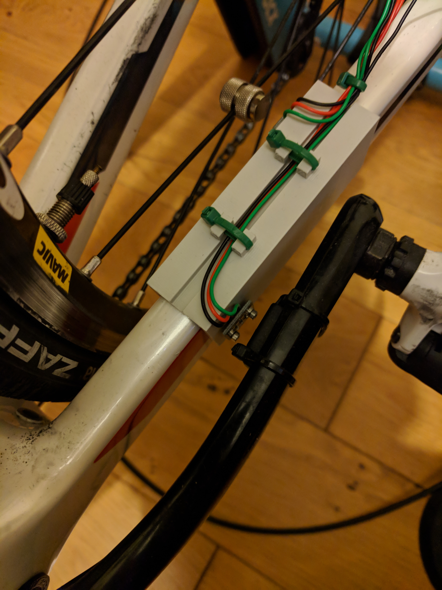
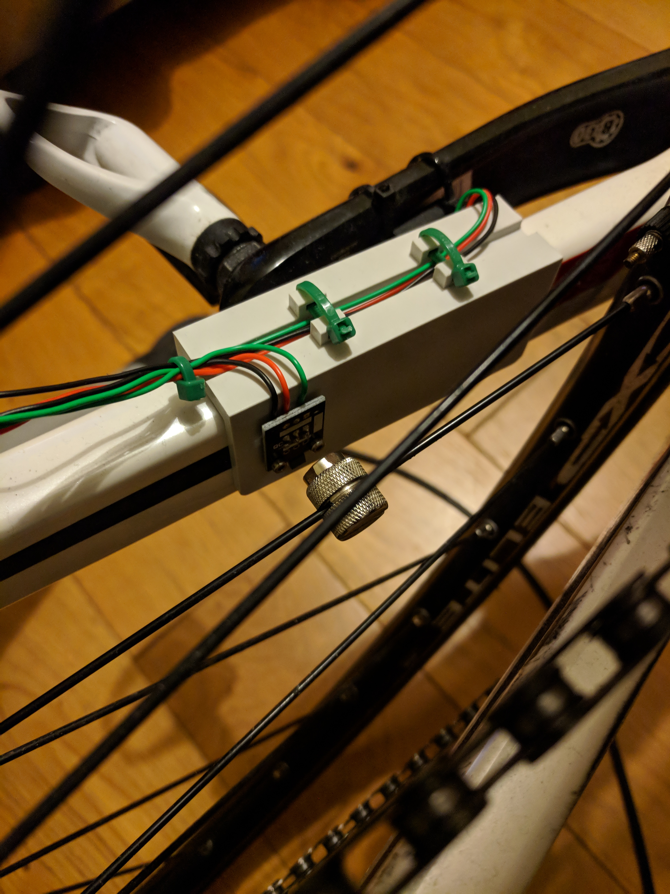
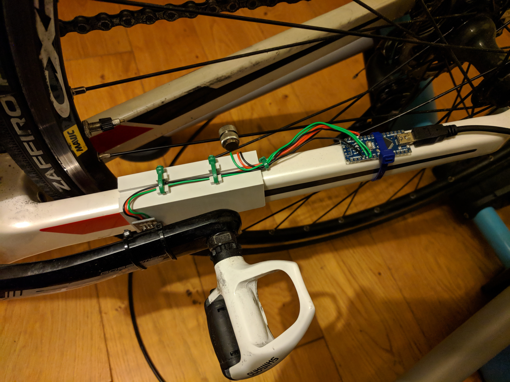
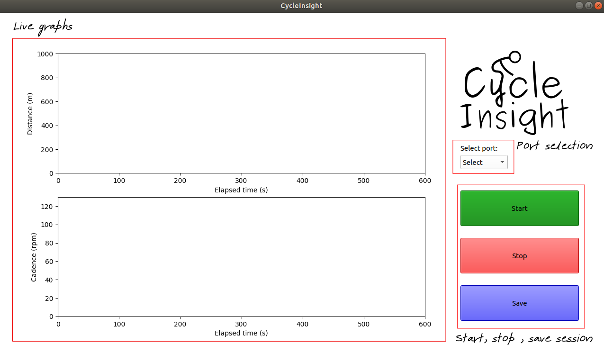

# Cycle Insight

Purpose of this project was to replace the hopeless cadence and distance sensor that came with my bike turbo. After a few weeks the only reading it output was the cadence which for the best part of £100 is a bit dissapointing. With this in mind I wanted to make it as cheap as possible so others could potentially build their own CI sensor in the future.

## Parts list

* Arduino Nano
* KY-003 Hall Effect Sensor x2
* Single core wire
* 3D printed bracket to fit bike chainstay
* Long USB Mini-B to Type A
* Two small magnets

## Features
* Animated session data - Users distance and candence is plotted on dynamic graphs within the GUI window
* Export session data to Excel workbook - Users session data can be exported to an Excel workbook within the 'session data' folder. Graphs of distance and cadence are automatically plotted within the workbook

## How to install
1. Make sure you have python 3.7.0 installed
2. Clone the Repo
3. 'cd cycleInsight/ci'
4. 'pip install requirements.txt'
5. Download and install the [timer](https://playground.arduino.cc/code/timer) library for Arduino
5. Fingers crossed that should be it...

## Assembly
1. Solder ground terminals on hall effect sensors to 'GND' on Arduino Nano
2. Solder 5v (vcc) terminals on hall effect sensors to '5V' on Arduino Nano
3. Solder one 'sig' terminal on hall effect sensor to digital pin 2 on the Arduino Nano - This is you distance sensor
4. Solder the other 'sig' terminal on hall effect sensor to digital pin 3 on the Arduino Nano - This is your cadence sensor
5. Stick one magnet onto the inside of your bike crank arm
6. Stick one magnet onto a spoke of your rear wheel
7. Arrange your hall effect sensors on your 3D printed bracket so the crank and rear wheel magnets will pass in front of them when you are pedalling. An example is shown below:

## How to use cycle insight
To get started with a session plug in the Arduino USB cable into a free port on your computer (yet to test with USB hubs so for now make sure its native to your device). Then do the following:
1. Select the port from the dropdown menu under the logo in the GUI
2. Click start to start the session. Note there is a tiny bit of lag between clicking start and the beginning of the data stream. This is to ensure the handshake between the program and the arduino is successful.
3. Pedal away...
4. When you want to stop the session click stop
5. If you want to save your session data then click save. The data will be saved into an Excel workbook under the session data folder in 'cycleInsight/ci/session data'

## Future development
* Bluetooth - No more USB cable
* Flask web server - Stream data to web server so session information can be viewed on mobile devices
* More visuals - Current distance, cadence and average cadence and speed
* User database - Store users session data for feedback on weekly/monthly/ all time distance travelled, cadence ect.
